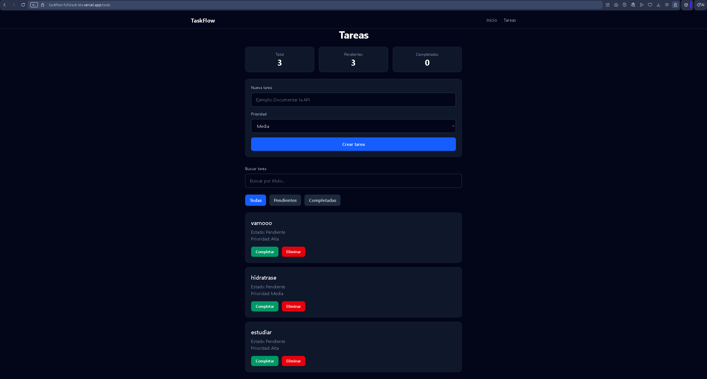
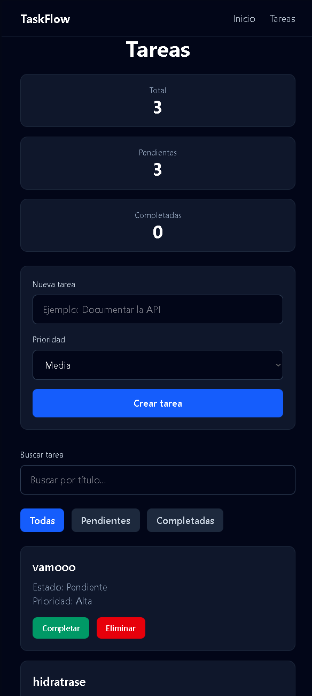
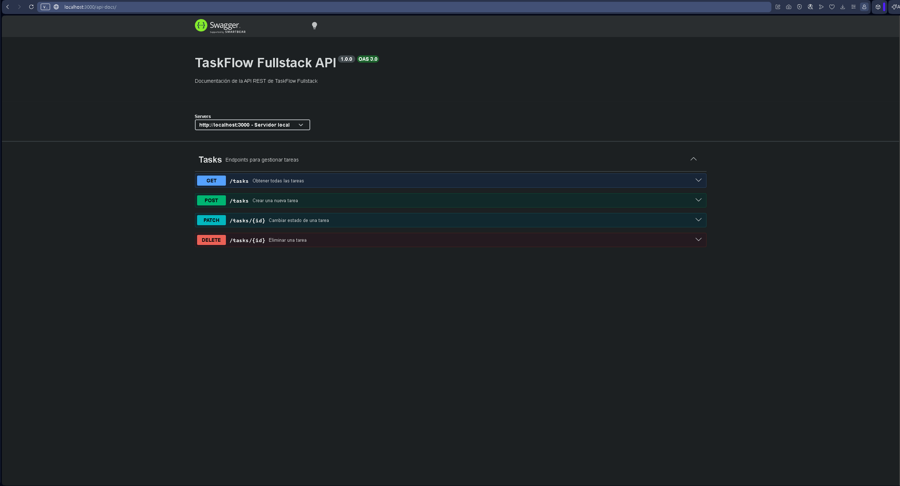

# TaskFlow Fullstack

Aplicación fullstack de gestión de tareas desarrollada con React, TypeScript, Express y SQLite.

Permite crear, editar, completar, eliminar, filtrar y buscar tareas mediante una API REST documentada con Swagger.

---

# Deploy

## Frontend
https://taskflow-fullstack-eta.vercel.app/tasks

## Backend API
https://taskflow-fullstack-6enn.onrender.com/api/v1/tasks

## Swagger UI
https://taskflow-fullstack-6enn.onrender.com/api-docs

---

# Funcionalidades

- Crear tareas
- Eliminar tareas
- Marcar como completadas
- Listado dinámico
- Filtros (Todas / Pendientes / Completadas)
- Buscador de tareas
- Estadísticas en tiempo real
- API REST completa
- Persistencia con SQLite
- Documentación Swagger

---

# Tecnologías

## Frontend
- React
- TypeScript
- Vite
- Context API
- CSS moderno

## Backend
- Node.js
- Express.js
- SQLite (better-sqlite3)
- Swagger (swagger-ui-express + swagger-jsdoc)
- CORS

---

# Arquitectura del proyecto

El proyecto está organizado como una aplicación fullstack separada en dos capas:

- Frontend (cliente)
- Backend (API REST)

---

## Estructura general

```
taskflow-fullstack/
│
├── client/                          # Frontend React + TypeScript
│   ├── src/
│   │   ├── api/                    # Llamadas a la API (fetch/axios)
│   │   ├── assets/                 # Recursos estáticos
│   │   ├── components/             # Componentes reutilizables
│   │   ├── context/                # Context API (estado global)
│   │   ├── hooks/                 # Custom hooks
│   │   ├── pages/                 # Vistas principales
│   │   ├── types/                 # Tipos TypeScript
│   │   └── App.tsx                # Router principal
│
├── server/                          # Backend Node.js + Express
│   ├── src/
│   │   ├── config/                # Configuración (DB, env)
│   │   ├── controllers/           # Controladores HTTP
│   │   ├── database/              # Conexión SQLite
│   │   ├── middlewares/          # Middlewares personalizados
│   │   ├── routes/               # Endpoints API REST
│   │   ├── services/             # Lógica de negocio
│   │   ├── swagger/              # Documentación Swagger
│   │   └── index.js              # Entrada del servidor
│
├── docs/                           # Documentación del proyecto
│   ├── images/                    # Capturas del README
│   ├── agile.md                  # Metodología
│   ├── idea.md                   # Idea del proyecto
│   ├── api.md                    # Documentación API
│   ├── architecture.md          # Arquitectura
│   └── deployment.md            # Deploy y configuración
│
├── README.md                      # Documentación principal
└── .gitignore
```
---
---

# Instalación local

## Clonar repositorio
```bash
git clone https://github.com/ismaelcontelles40-debug/taskflow-fullstack.git
```

---

## Backend
```bash
cd server
npm install
npm run dev
```

Servidor:
```
http://localhost:3000
```

---

## Frontend
```bash
cd client
npm install
npm run dev
```

Frontend:
```
http://localhost:5173
```

---

# API Endpoints

## Obtener tareas
```
GET /api/v1/tasks
```

## Crear tarea
```
POST /api/v1/tasks
```

## Actualizar tarea
```
PATCH /api/v1/tasks/:id
```

## Eliminar tarea
```
DELETE /api/v1/tasks/:id
```

---

# Context API

Se utiliza Context API para la gestión global del estado:

- Estado centralizado de tareas
- Evita prop drilling
- Sincronización con backend
- Lógica CRUD centralizada

---

# Base de datos

SQLite con better-sqlite3.

Archivo:
```
server/taskflow.db
```

---

# Capturas

## Presentación


---
---

## Vista móvil


---
---

## Swagger


---

# Scripts

## Backend
```
npm run dev
```

## Frontend
```
npm run dev
```

---

# Autor

Proyecto desarrollado por Ismael Contelles

Bootcamp / ASIR - Proyecto Fullstack de práctica profesional

---
